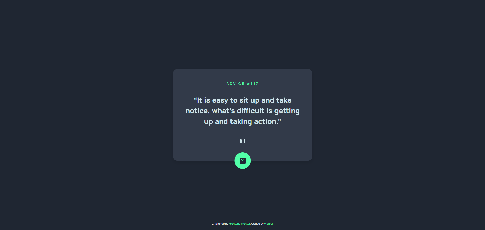

# Frontend Mentor - Advice generator app solution

This is a solution to the [Advice generator app challenge on Frontend Mentor](https://www.frontendmentor.io/challenges/advice-generator-app-QdUG-13db). Frontend Mentor challenges help you improve your coding skills by building realistic projects.

## Table of contents

- [Overview](#overview)
  - [The challenge](#the-challenge)
  - [Screenshot](#screenshot)
  - [Links](#links)
- [My process](#my-process)
  - [Built with](#built-with)
  - [What I learned](#what-i-learned)
  - [Continued development](#continued-development)
- [Author](#author)

## Overview

### The challenge

Users should be able to:

- View the optimal layout for the app depending on their device's screen size
- See hover states for all interactive elements on the page
- Generate a new piece of advice by clicking the dice icon

### Screenshot



### Links

- Solution URL: [Github](https://github.com/waifal/advice-generator-app)
- Live Site URL: [Live Demo](https://advice-generator-app-kappa-topaz.vercel.app/)

## My process

I started by building the basic layout and styling the advice card using HTML and CSS. Then, I used JavaScript to fetch random advice from the [Advice Slip API](https://api.adviceslip.com/). At first, I tried using callbacks with `XMLHttpRequest`, but later I rewrote it with `Promises` and `async/await` to make the code cleaner and easier to manage.

I also added error handling for failed requests and made the button disable while loading to prevent multiple clicks. Finally, I focused on making the design responsive so the card stays centered and looks good on all screen sizes, especially mobile.

### Built with

- Semantic HTML5 markup
- CSS custom properties
- Flexbox
- CSS Grid
- JavaScript (ES6+)

### What I learned

Through building this project, I learned how to fetch data from an API and handle it asynchronously using `Promises` and `async/await`. I practiced dynamically updating the DOM, managing UI states like disabling buttons during loading, and handling errors gracefully. I also improved my skills in creating responsive layouts using Flexbox, Grid, and CSS custom properties.

#### Example Code

```javascript
function fetchAdvice() {
    return new Promise(function(resolve, reject) {
        const xhr = new XMLHttpRequest();

        xhr.open('GET', API_URL + '?timestamp=' + new Date().getTime() + Math.random(), true); // prevent caching
        xhr.responseType = 'json';

        xhr.onload = function() {
            if(xhr.status === 200) {
                resolve(xhr.response);
            } else {
                reject(new Error(`Request failed! Status code: ${xhr.status} - ${xhr.statusText}`));
            }
        }

        xhr.onerror = function() {
            reject(new Error(`Network error - request could not be sent or received!`));
        }

        xhr.send();
    });
}

async function handleAdvice() {
    adviceBtn.disabled = true;

    try {
        const data = await fetchAdvice();

        adviceNumberId.textContent = '#' + data.slip.id;
        adviceText.innerHTML       = '&#8220;' + data.slip.advice + '&#8221;';

    } catch(err) {
        console.error(err.message);
    } finally {
        adviceBtn.disabled = false;
    }
}
```

### Continued development

In future projects, I want to continue practicing and deepening my understanding of `Promises`, `async/await`, and `callback` functions to handle *asynchronous* operations more efficiently. I also aim to improve my skills in state management, learning how to better control UI states during data fetching and interactions. Additionally, I plan to explore caching strategies to optimize performance and reduce unnecessary API requests, as well as gaining more experience using and developing APIs to build more dynamic and interactive applications.

## Author

- Website - [Wai Falwasser](https://github.com/waifal)
- Frontend Mentor - [@waifal](https://www.frontendmentor.io/profile/waifal)
